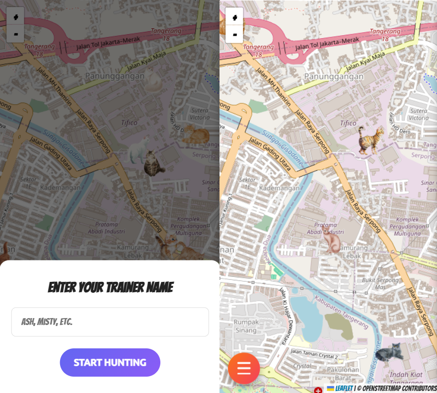
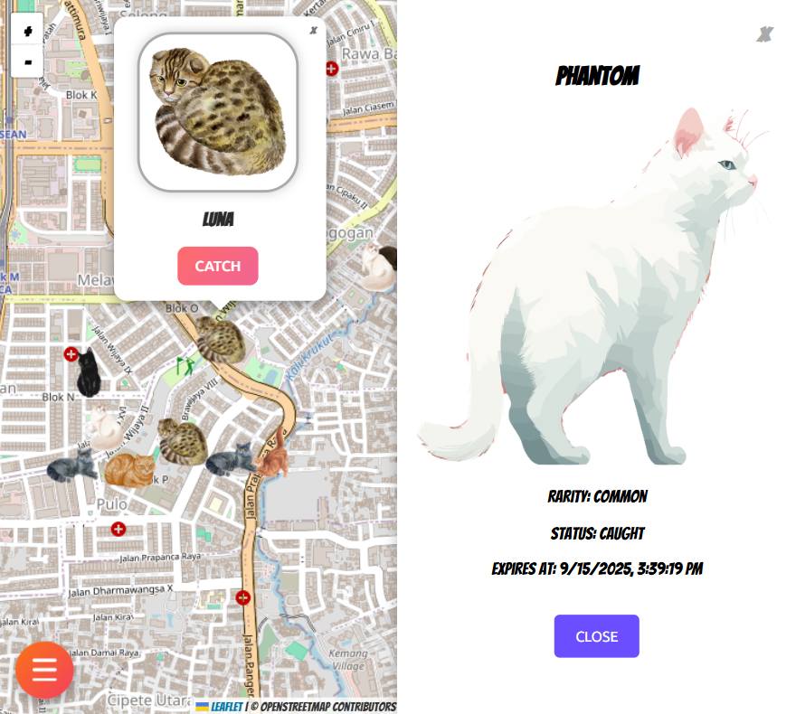
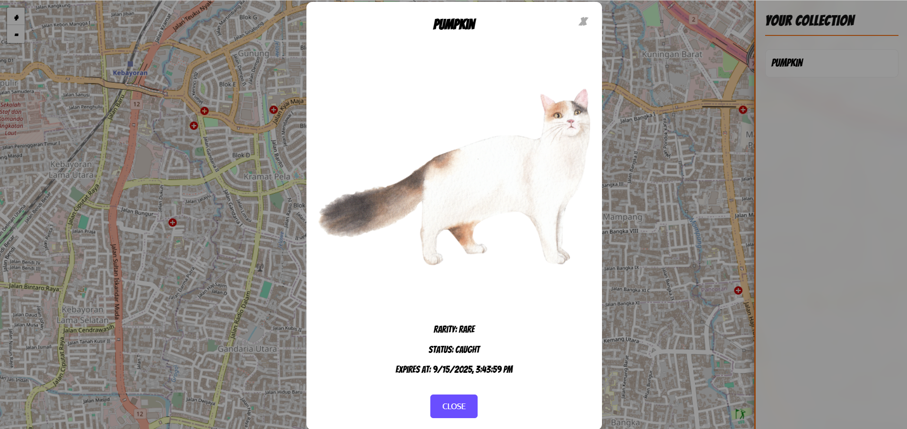

# Pokecat Hunt

Pokecat Hunt is a real-time location-based game inspired by Pokémon Go but with cats.  
Players can explore a map, discover wild Pokecats, and catch them before they disappear.  

This project is split into two main parts:

- **Backend**: Express + Socket.IO server that spawns Pokecats and broadcasts them to clients.
- **Frontend**: React + Vite + Leaflet map that displays wild Pokecats and lets users catch them.

Pokecat Hunt is a small experimental project consisting of a backend (Express + Socket.IO) and a frontend (React + Leaflet).  
The idea is to place virtual "Pokecats" on a map that players can see and potentially interact with.  

Beyond its simple game-like appearance, the backend also attempts to simulate **race conditions**.  
For example, when multiple players try to "catch" or interact with the same Pokecat at the same time, the system needs to handle concurrent events correctly.  
This project is designed as a lightweight prototype to explore how race conditions can be triggered, observed, and mitigated in a multiplayer-like environment.

---

## Features

- Interactive Map built with [Leaflet](https://leafletjs.com/) and React Leaflet  
- Pokecat Spawning handled by the server with random rarity and expiration  
- Real-time Updates powered by Socket.IO  
- Custom Styling with SCSS  
- Modern Frontend using Vite + React 19  
- TypeScript across both backend and frontend

---

## Screenshots

### Gameplay 1


### Gameplay 2


### Gameplay 3


---

## Project Structure

```
pokecat-hunt/
├── backend/      # Express + Socket.IO server
│   ├── src/
│   └── package.json
├── frontend/     # React + Vite + Leaflet app
│   ├── src/
│   └── package.json
├── package.json  # Root scripts (runs both frontend & backend)
```

---

## Requirements

- [Node.js](https://nodejs.org/) (>= 18)
- [pnpm](https://pnpm.io/) (recommended for workspace monorepo)

---

## Getting Started

### 1. Install dependencies
```bash
pnpm install
```

### 2. Run development servers (frontend + backend concurrently)
```bash
pnpm dev
```

- Backend runs on: **http://localhost:3000**  
- Frontend runs on: **http://localhost:5173**

### 3. Build frontend
```bash
pnpm --filter frontend build
```

---

## Scripts

### Root
- `pnpm dev` – Run backend + frontend together
- `pnpm test` – Placeholder test script

### Backend (`/backend`)
- `pnpm dev` – Start backend with ts-node-dev

### Frontend (`/frontend`)
- `pnpm dev` – Start frontend with Vite
- `pnpm build` – Build production bundle
- `pnpm preview` – Preview built frontend

---

## Tech Stack

- **Backend**: Express, Socket.IO, TypeScript  
- **Frontend**: React 19, Vite, React Leaflet, SCSS  
- **Tooling**: ESLint, TypeScript, pnpm workspaces, concurrently  

---

## Game Design

Pokecat Hunt is structured as a lightweight location-based game prototype. The design borrows concepts from real-world augmented reality games but keeps the scope simple for demonstration and experimentation.

### Core Loop
1. Players enter their trainer name and start the session.  
2. The server continuously spawns Pokecats near the player’s reported location.  
3. Wild Pokecats appear on the map with a limited lifetime before they expire.  
4. Players attempt to catch Pokecats; if successful, the Pokecat is marked as caught and removed from the wild pool.  
5. The player’s collection grows as they capture different Pokecats.

### Key Mechanics
- **Spawning**: The backend generates Pokecats with randomized rarity and places them near active players.  
- **Expiration**: Each Pokecat has a countdown timer. Once expired, it disappears from the map.  
- **Catching**: Players can catch a Pokecat once, and the action is broadcast to other players to prevent duplication.  
- **Rarity**: Pokecats are classified as *common*, *rare*, or *legendary* with different spawn probabilities.  
- **Race Conditions**: The system simulates real-time contention, where multiple players may try to catch the same Pokecat simultaneously.

### Design Goals
- Provide a simple but engaging prototype for real-time, map-based multiplayer mechanics.  
- Highlight concurrency and synchronization issues in multiplayer games.  
- Serve as a foundation for further experiments such as persistence, authentication, or advanced map events.  

---

## License

This project is licensed under the [License](./LICENSE).

---

## Roadmap / Ideas

- Add rarity system (common, rare, legendary) with unique visuals  
- Store player caught list with persistence (DB or local storage)  
- Add authentication system for multiplayer progress  
- Expand map interactions (items, events, challenges)  
