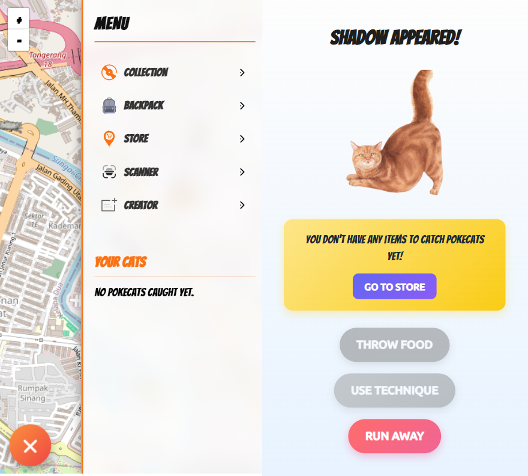
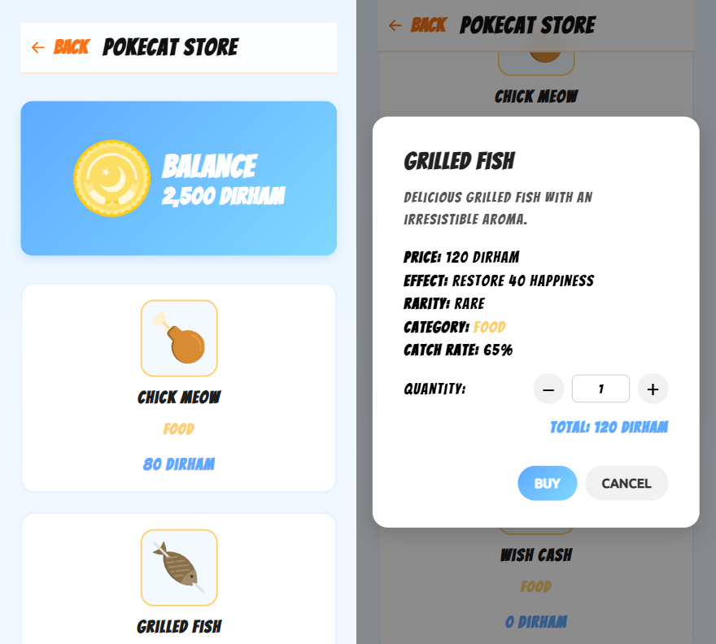

# Pokecat Hunt

**Pokecat Hunt** is a real-time, location-based prototype game inspired by Pokémon Go — but featuring cats instead.  
Players explore a map, discover nearby wild Pokecats, and try to catch them before they disappear.

This monorepo project consists of multiple coordinated components:

- **Backend** — Express + Socket.IO server that spawns Pokecats and handles real-time communication.  
- **Frontend** — React + Vite + Leaflet map client for exploring and catching Pokecats.  
- **Services** — Go + MongoDB service that provides Pokecat data through a REST API.  
- **Storages** — Local file storage acting as an object bucket for serving Pokecat images.

Pokecat Hunt is designed as a lightweight prototype for experimenting with concurrency, synchronization, and persistence in a multiplayer-like environment.  
The backend intentionally simulates **race conditions**, such as when multiple players try to catch the same Pokecat simultaneously, requiring the system to handle concurrent events safely.

---

## Features

- Real-time gameplay powered by **Socket.IO**  
- Interactive world map using **React Leaflet**  
- RESTful microservice written in **Go** and connected to **MongoDB**  
- Local image hosting via Node.js (`storages/run.js`)  
- Concurrent spawning and catching logic to simulate **race conditions**  
- Modern frontend stack: **React 19 + TypeScript + SCSS + Vite**

---

## Demo


---

## Screenshots

### Gameplay 1


### Gameplay 2


### Gameplay 3


### Gameplay 4


### Gameplay 5


---

## Project Structure

```
pokecat-hunt/
├── apps/
│   ├── backend/      # Express + Socket.IO server
│   ├── frontend/     # React + Vite + Leaflet app
│   ├── services/     # Go + MongoDB REST API service
│   ├── storages/     # Local static and image files
│   └── database/     # Database backups and sample data
├── screenshots/      # Gameplay screenshots
├── docs/             # Architecture and documentation
├── package.json      # Root scripts (runs all apps)
├── pnpm-workspace.yaml
└── tsconfig.json
```

---

## Requirements

- [Node.js](https://nodejs.org/) **>= 18**
- [pnpm](https://pnpm.io/) (recommended for monorepo setup)
- [Go](https://go.dev/) **>= 1.21**
- [MongoDB](https://www.mongodb.com/) (running locally on `localhost:27017`)

---

## Getting Started

### 1. Install dependencies
```bash
pnpm install
```

### 2. Run development servers (frontend, backend, and Go service)
```bash
pnpm dev
```

**Default ports:**
- Storage: `http://localhost:7621`  
- Go service: `http://localhost:5000`
- Backend: `http://localhost:4000`  
- Frontend: `http://localhost:5173`

### 3. Build frontend
```bash
pnpm --filter frontend build
```

---

## Scripts

### Root
- `pnpm dev` — Run backend, frontend, and Go service concurrently  
- `pnpm test` — Placeholder test command  

### Backend (`/apps/backend`)
- `pnpm dev` — Start backend using `ts-node-dev`  

### Frontend (`/apps/frontend`)
- `pnpm dev` — Run Vite development server  
- `pnpm build` — Build production bundle  
- `pnpm preview` — Preview production build  

### Services (`/apps/services`)
- `go run main.go` — Run Go service manually  
- `node run.js` — Node.js wrapper to start Go service  

### Storages (`/apps/storages`)
- `node run.js` — Start local static file server  

---

## MongoDB Collection

Ensure that MongoDB is running and accessible before starting the Go service.  
You can verify the connection using **MongoDB Compass** or any CLI tool.

**Database:** `pokecat_hunt`  
**Collection:** `cats`

Example documents:

```json
{
  "_id": { "$oid": "68e25796c31da84ccd02b385" },
  "name": "Mochi",
  "iconUrl": "http://localhost:7621/cats/mochi.png",
  "rarity": "common"
},
{
  "_id": { "$oid": "68e25796c31da84ccd02b387" },
  "name": "Luna",
  "iconUrl": "http://localhost:7621/cats/luna.png",
  "rarity": "rare"
}
```

The Go service exposes the data via:

```http
GET http://localhost:5000/api/cats
```

---

## Tech Stack

| Layer | Technologies |
|-------|---------------|
| **Backend** | Express, Socket.IO, TypeScript |
| **Frontend** | React 19, Vite, React Leaflet, SCSS, Zustand, Vitest |
| **Services** | Go, MongoDB, Gorilla Mux |
| **Tooling** | ESLint, TypeScript, pnpm workspaces, concurrently |

---

## Architecture Overview


---

## Game Design

Pokecat Hunt is structured as a simple, location-based prototype inspired by AR-style gameplay.  
It demonstrates real-time interactions, event synchronization, and concurrency in a minimal setup.

### Core Loop

1. Players enter a trainer name and begin the session.  
2. The backend continuously spawns Pokecats near the player’s location.  
3. Wild Pokecats appear on the map for a limited time before expiring.  
4. Players attempt to catch Pokecats; successful catches are broadcast to all players.  
5. The player’s collection grows as they catch new Pokecats.  
6. Players can also "scan" real cats (simulated) to generate new Pokecats via the Go API.  
7. Custom Pokecats can be designed and uploaded by players, while attributes like rarity are system-generated.

### Key Mechanics

- **Spawning** — Backend randomly spawns Pokecats near active players.  
- **Expiration** — Each Pokecat has a lifetime countdown.  
- **Catching** — Catch events are broadcast globally to prevent duplicates.  
- **Rarity** — Classified as *common*, *rare*, or *legendary*.  
- **Persistence** — Pokecats are stored in MongoDB via the Go service.  
- **Concurrency** — Simulated race conditions test simultaneous catches by multiple players.

### Design Goals

- Deliver a compact prototype of real-time, map-based multiplayer interaction.  
- Explore concurrency, synchronization, and database persistence patterns.  
- Serve as a foundation for future expansions such as authentication, player collections, or advanced events.

---

## Roadmap / Future Ideas

- Improve rarity system visuals (common → rare → legendary)  
- Persist player collections in MongoDB  
- Add authentication and player progression  
- Expand map interactions with items, events, and challenges  
- Extend Go service for leaderboards and player stats  

---

## License

This project is licensed under the [MIT License](./LICENSE).
