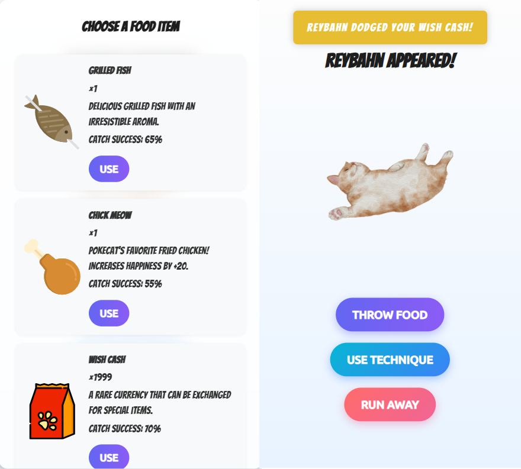

# Pokecat Hunt

Pokecat Hunt is a real-time location-based game inspired by Pokémon Go but with cats.  
Players can explore a map, discover wild Pokecats, and catch them before they disappear.  

This project is split into three main parts:

- **Backend**: Express + Socket.IO server that spawns Pokecats and broadcasts them to clients.
- **Frontend**: React + Vite + Leaflet map that displays wild Pokecats and lets users catch them.
- **Services**: Go + MongoDB service that stores and serves Pokecat data via REST API.

Pokecat Hunt is a small experimental project consisting of a backend (Express + Socket.IO),  
a frontend (React + Leaflet), and a Go service connected to MongoDB.  
The idea is to place virtual "Pokecats" on a map that players can see and interact with.  

Beyond its simple game-like appearance, the backend also attempts to simulate **race conditions**.  
For example, when multiple players try to "catch" or interact with the same Pokecat at the same time,  
the system needs to handle concurrent events correctly.  

This project is designed as a lightweight prototype to explore how race conditions and  
database-backed persistence can be combined in a multiplayer-like environment.

---

## Features

- Interactive Map built with [Leaflet](https://leafletjs.com/) and React Leaflet  
- Pokecat Spawning handled by the server with random rarity and expiration  
- Real-time Updates powered by Socket.IO  
- Cat Database Service with Go + MongoDB  
- REST API endpoint `/api/cats` to fetch available Pokecats from MongoDB  
- Custom Styling with SCSS  
- Modern Frontend using Vite + React 19  
- TypeScript across both backend and frontend  

---

## Demo


---

## Screenshots

### Gameplay 1


### Gameplay 2


### Gameplay 3


### Gameplay 4


### Gameplay 5


### Desktop Version


---

## Project Structure

```
pokecat-hunt/
├── apps/
│   ├── backend/      # Express + Socket.IO server
│   ├── frontend/     # React + Vite + Leaflet app
│   └── services/     # Go + MongoDB service
│       ├── main.go
│       └── start-go-server.js
├── storages/         # (optional) static or persisted files
├── screenshots/      # project screenshots
├── package.json      # Root scripts (runs frontend, backend & services)
├── pnpm-workspace.yaml
└── tsconfig.json
```

---

## Requirements

- [Node.js](https://nodejs.org/) (>= 18)
- [pnpm](https://pnpm.io/) (recommended for workspace monorepo)
- [Go](https://go.dev/) (>= 1.21)
- [MongoDB](https://www.mongodb.com/) (running on `localhost:27017`)

---

## Getting Started

### 1. Install dependencies
```bash
pnpm install
```

### 2. Run development servers (frontend + backend + Go service concurrently)
```bash
pnpm dev
```

- Go service runs on: **http://localhost:5000** (REST API `/api/cats`)  
- Backend runs on: **http://localhost:3000**  
- Frontend runs on: **http://localhost:5173**

### 3. Build frontend
```bash
pnpm --filter frontend build
```

---

## Scripts

### Root
- `pnpm dev` – Run backend + frontend + Go service together
- `pnpm test` – Placeholder test script

### Backend (`/apps/backend`)
- `pnpm dev` – Start backend with ts-node-dev

### Frontend (`/apps/frontend`)
- `pnpm dev` – Start frontend with Vite
- `pnpm build` – Build production bundle
- `pnpm preview` – Preview built frontend

### Services (`/apps/services`)
- `go run main.go` – Run Go service manually
- `node start-go-server.js` – Wrapper to start Go server via Node.js

---

## MongoDB Collection

Database: **pokecat_hunt**  
Collection: **cats**

Example documents:

```json
{
  "name": "Whiskers",
  "iconUrl": "http://localhost:4000/static/cats/whiskers.png",
  "rarity": "common"
}
{
  "name": "Luna",
  "iconUrl": "http://localhost:4000/static/cats/luna.png",
  "rarity": "rare"
}
{
  "name": "Shadow",
  "iconUrl": "http://localhost:4000/static/cats/shadow.png",
  "rarity": "rare"
}
```

The Go service exposes these via:

```http
GET http://localhost:5000/api/cats
```

---

## Tech Stack

- **Backend**: Express, Socket.IO, TypeScript  
- **Frontend**: React 19, Vite, React Leaflet, SCSS  
- **Services**: Go, MongoDB, Gorilla Mux  
- **Tooling**: ESLint, TypeScript, pnpm workspaces, concurrently  

---

## Game Design

Pokecat Hunt is structured as a lightweight location-based game prototype.  
The design borrows concepts from real-world augmented reality games but keeps the scope simple for demonstration and experimentation.

### Core Loop
1. Players enter their trainer name and start the session.  
2. The server continuously spawns Pokecats near the player’s reported location.  
3. Wild Pokecats appear on the map with a limited lifetime before they expire.  
4. Players attempt to catch Pokecats; if successful, the Pokecat is marked as caught and removed.  
5. The player’s collection grows as they capture different Pokecats.  

### Key Mechanics
- **Spawning**: Backend generates Pokecats with randomized rarity near active players.  
- **Expiration**: Each Pokecat has a countdown timer.  
- **Catching**: Players can catch once; action is broadcast to all players.  
- **Rarity**: Classified as *common*, *rare*, *legendary*.  
- **Persistence**: Pokecats stored in MongoDB via Go service.  
- **Race Conditions**: Simulated real-time contention when multiple players catch at once.  

### Design Goals
- Provide a simple but engaging prototype for real-time, map-based multiplayer mechanics.  
- Highlight concurrency, synchronization, and persistence issues in multiplayer games.  
- Serve as a foundation for further experiments (authentication, advanced events, etc).  

---

## License

This project is licensed under the [License](./LICENSE).

---

## Roadmap / Ideas

- Expand rarity system visuals (common, rare, legendary)  
- Store player caught list persistently in DB  
- Add authentication system for multiplayer progress  
- Expand map interactions (items, events, challenges)  
- Enhance Go service to support player collections & leaderboards  
